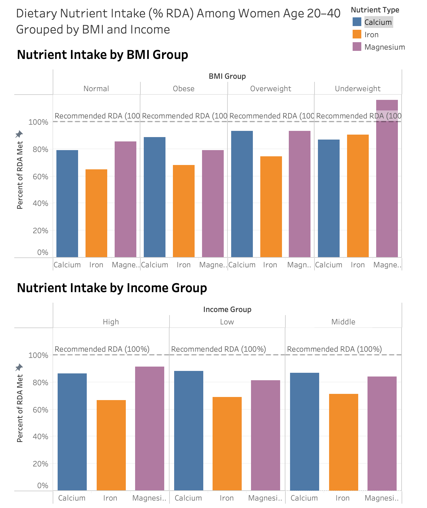

# 🥗 Nutrient Intake Analysis: NHANES Dashboard

This project explores how average nutrient intake (specifically Calcium, Iron, and Magnesium) varies by BMI and income level among U.S. women aged 20–40. Using NHANES public health data, I built a primarily Python-based ETL pipeline to process and aggregate the data, and then visualized the results in Tableau.

---

## 🧠 Why This Project

The goal was to practice working with raw health data and transform it into something meaningful and interpretable. I wanted to understand how women's nutrition in the U.S. correlates with socioeconomic factors and body metrics, and to present that insight through a clean, interactive dashboard. The project includes full-cycle data analysis: from cleaning raw files to finishing an interactive dashboard.

---

## 🔨 Tools Used

- **Python** (ETL pipeline with pandas; SQL-logic)
- **Tableau Public** (data viz + dashboard)
- **NHANES .XPT files** (CDC data)
- **CSV output** for clean Tableau integration

---

## 📁 What's in This Repo

  

| File | Description |
|------|-------------|
| `main.py` | Runs the full pipeline |
| `extract.py` | Loads and parses NHANES `.xpt` files |
| `transform.py` | Cleans and merges demographic, dietary, and BMI data |
| `load.py` | Groups nutrient intake by BMI and income and saves CSVs |
| `cleaned_data.csv` | Final dataset used for the dashboard |
| `nhanesdash.png` | Screenshot of Tableau dashboard |
| `README.md` | Project overview (this file) |

---

## 📊 Dashboard Overview

The final Tableau dashboard shows:

- % RDA met for **Calcium**, **Iron**, and **Magnesium**
- Split by both **BMI group** and **income group**
- Includes a 100% RDA reference line (aka recommendation) to make gaps clear

🔗 **[View the dashboard on Tableau Public](https://public.tableau.com/app/profile/yuri.oni/viz/NutrientIntakeRDAbyBMIandIncomeinWomenNHANESData/Dashboard1)**

---

## 📚 Data Source

This project uses data from the **National Health and Nutrition Examination Survey (NHANES)** run by the U.S. CDC. Specifically:

- **Cycle**: 2017–2018
- **Population filtered**: Women aged 20 to 40
- **Files used**:
  - `DEMO_J.XPT` (Demographics)
  - `DR1TOT_J.XPT` (Nutrient intake from 24-hour recall)
  - `BMX_J.XPT` (Body measures like BMI)

📎 Link to the dataset portal:  
https://wwwn.cdc.gov/nchs/nhanes/search/datapage.aspx?Component=Demographics&CycleBeginYear=2017

---

## 🧪 How to Run

1. Clone this repo and run the pipeline:

```bash
git clone https://github.com/yourusername/nutrition-dashboard.git
cd nutrition-dashboard
python main.py
```

2. Run the ETL pipeline:

```bash
python main.py
```
3. Open the cleaned_data.csv in Tableau Public to explore or rebuild the dashboard!

---

## 🛠 Tools & Technologies

| Stage           | Tool/Tech               |
| --------------- | ----------------------- |
| Data Extraction | Python, `xport` library |
| Data Cleaning   | pandas, numpy           |
| Data Source     | NHANES `.XPT` files     |
| Visualization   | Tableau Public          |

---

## 🧠 Key Learnings
- Built a modular ETL pipeline from raw .XPT files to analysis-ready CSVs
- Visualized multivariate relationships (BMI × Income × RDA) in Tableau
- Reinforced real-world skills in transformation, grouping, and BI storytelling

---

# 👩‍💻 About me!
**Yuri Onimura**  
Data Analyst \| UC Berkeley Class of 2025  
**[Linkedin](linkedin.com/in/yuri-onimura)**


